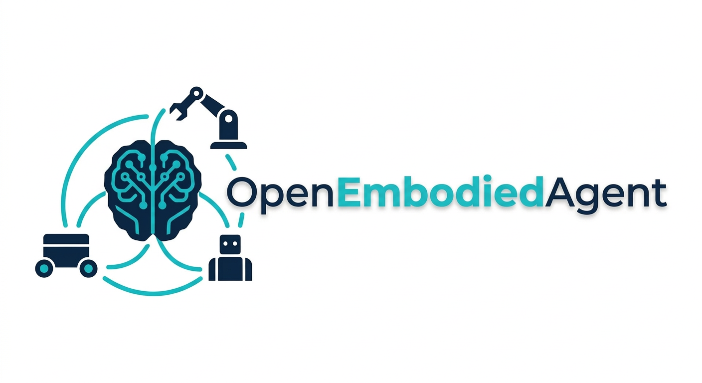

<div align="center">
  
  <h1>OpenEmbodiedAgent (OEA)</h1>
  <p><b>A Decoupled Protocol-Based Framework for Self-Evolving and Cross-Embodiment Agents</b></p>
  <p>
    <a href="./README.md">English</a> | <a href="./README_zh.md">中文</a>
  </p>
  <p>
    
    
    
  </p>
</div>

## 📖 Introduction

**OpenEmbodiedAgent (OEA)** is a self-evolving embodied AI framework based on Agentic workflows. Moving away from the "black-box" model of traditional "large models directly controlling hardware," OEA pioneers a **"Cognitive-Physical Decoupling"** architectural paradigm. By constructing a Language-Action Interface, it completely decouples action representation from embodiment morphology, enabling standardized mapping from high-reasoning cloud models to edge physical execution layers.

OEA utilizes a **"State-as-a-File"** protocol matrix, natively supporting zero-code migration across hardware platforms, sandbox-driven tool self-generation, and safety correction mechanisms based on Multi-Agent Critic verification.

## ✨ Core Features

*   📝 **State-as-a-File**: Software and hardware communicate by reading/writing local Markdown files (e.g., `ENVIRONMENT.md`, `ACTION.md`), ensuring complete decoupling and extreme transparency.
*   🧠 **Dual-Track Multi-Agent System**:
    *   **Track A (Cognitive Core)**: Includes Planner and Critic mechanisms. Large models do not issue commands directly; they must be verified by the Critic against the current robot's runtime `EMBODIED.md` (copied from profiles) before being committed.
    *   **Track B (Physical Execution)**: An independent hardware watchdog (`hal_watchdog.py`) monitors and executes commands. Supports both single-instance mode and **Fleet mode** for multi-robot coordination.
*   🔌 **Dynamic Plugin Mechanism**: Supports dynamic loading of external hardware drivers via `hal/drivers/`, allowing for new hardware support without modifying core code.
*   🛡️ **Safety Correction Mechanism**: Strict action verification and `LESSONS.md` experience library prevent Agent workflows from going out of control.
*   🎮 **Simulation Loop**: Built-in lightweight simulation support allows verification of the full chain from natural language instructions to physical state changes without real hardware.
*   🗺️ **Semantic Navigation & Perception**: Built-in `SemanticNavigationTool` and `PerceptionService` support resolving high-level semantic goals into physical coordinates and constructing scene graphs by fusing geometric and semantic information.

## 🏗️ Architecture

OEA's core is a local workspace where software and hardware operate as independent daemons reading/writing files:

<div align="center">
  
</div>

## 🚀 Quick Start

### 1. Install Dependencies
```bash
git clone https://github.com/your-repo/OpenEmbodiedAgent.git
cd OpenEmbodiedAgent
pip install -e .
# Install simulation dependencies (e.g., watchdog)
pip install watchdog

# Optional: Install external ReKep real-world plugin
python scripts/deploy_rekep_real_plugin.py \
  --repo-url https://github.com/baiyu858/oea-rekep-real-plugin.git
```

### 2. Initialize Workspace
```bash
OEA onboard
```
This generates core Markdown protocol files in the current workspace. Single-instance mode defaults to `~/.OEA/workspace/`; Fleet mode uses a shared workspace and multiple robot workspaces under `~/.OEA/workspaces/`.

### 3. Start the System
Open two terminals:

**Terminal 1: Start Hardware Watchdog & Simulation (Track B)**
```bash
python hal/hal_watchdog.py
```
To use real-world ReKep instead of simulation, install the plugin and run:
```bash
python hal/hal_watchdog.py --driver rekep_real
```

**Terminal 2: Start Brain Agent (Track A)**
```bash
OEA agent
```

### 4. Interaction Example
In the `OEA agent` CLI, input:
> "Look at what is on the table, then push that apple to the floor."

You will see the action execution in the simulation logs in Terminal 1, and receive completion confirmation from the Agent in Terminal 2.

## 📁 Project Structure

```text
OpenEmbodiedAgent/
├── OEA/                # Track A: Software Brain Core
│   ├── agent/              # Agent Logic (Planner, Critic)
│   ├── templates/          # Workspace Markdown Templates
│   └── ...
├── hal/                    # Track B: Hardware HAL & Simulation
│   ├── hal_watchdog.py     # Hardware Watchdog Daemon
│   └── simulation/         # Simulation Environment Code
├── scripts/                # External HAL Plugin Deployment
│   └── deploy_rekep_real_plugin.py
├── workspace/              # Single-instance Runtime Workspace
│   ├── EMBODIED.md         # Runtime Robot Profile
│   ├── ENVIRONMENT.md      # Current Scene-Graph
│   ├── ACTION.md           # Pending Action Commands
│   ├── LESSONS.md          # Failure Experience Records
│   └── SKILL.md            # Successful Workflow SOP
├── workspaces/             # Fleet Topology
│   ├── shared/             # Agent Workspace & Global ENVIRONMENT.md
│   ├── go2_edu_001/        # Robot-local ACTION.md / EMBODIED.md
│   └── ...
├── docs/                   # Project Documentation
│   ├── PLAN.md             # Detailed Implementation Plan
│   └── PROJ.md             # Project Whitepaper & Architecture
├── README.md               # English Documentation
└── README_zh.md            # Chinese Documentation
```

## 🗺️ Roadmap

- **Phase 1**: Desktop Loop & Markdown Protocol Establishment.
    - [x] v0.0.1: Framework Design & Initialization
    - [x] v0.0.2: Embodied Skill Plugin Deployment & Invocation Design
    - [x] v0.0.3: Visual Decoupling + Grasping Pipeline (SAM3 & ReKep)
    - [x] v0.0.4: Atomic Action-based VLN Pipeline (SAM3)
    - [x] v0.0.5: Multi-Agent Protocol Design
    - [ ] v0.0.6: Long-horizon Task Decomposition, Orchestration & Execution
    - [ ] v0.0.7: IoT Device Integration (e.g., XiaoZhi)
- **Phase 2**: Multi-Embodiment Coordination & Multi-modal Memory.
- **Phase 3**: Constraint Solving & High-level Heterogeneous Coordination.

## 🤝 Contribute

PRs and Issues are welcome! Please refer to `docs/USER_DEVELOPMENT_GUIDE.md` for detailed architecture design and development guidelines.

---

**Special Thanks**: This project is developed based on [nanobot](https://github.com/your-repo/nanobot), thanks for providing the lightweight Agent runtime base. Everyone is welcome to go to the [nanobot](https://github.com/your-repo/nanobot) repository and give it a star!
